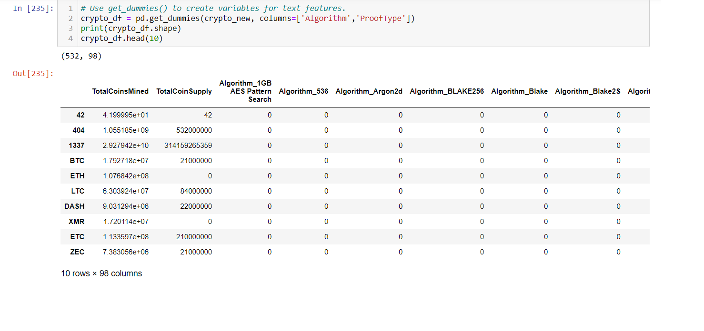
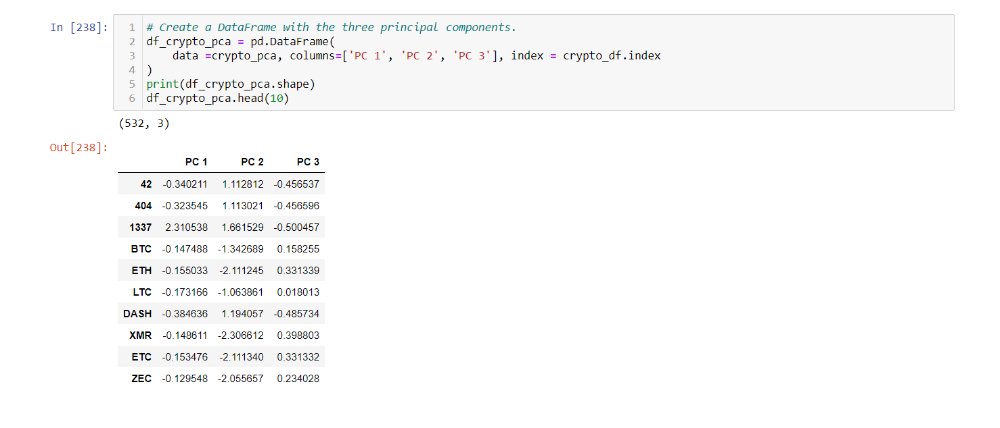
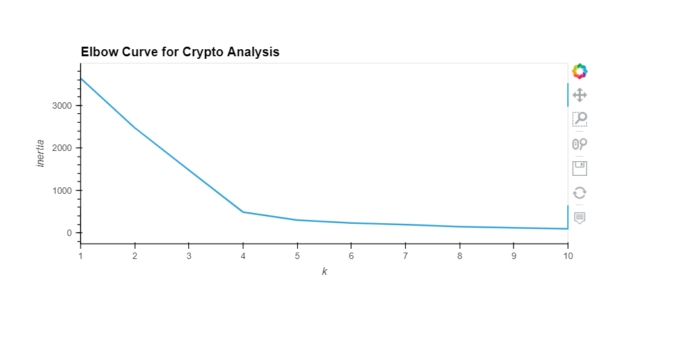
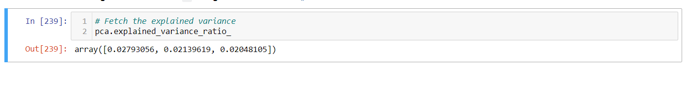
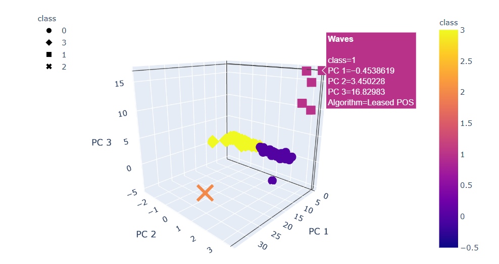
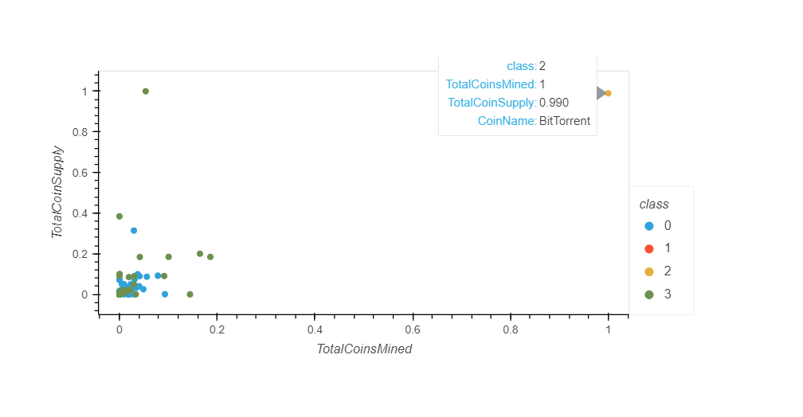

# **Cryptocurrencies**

Cryptocurrencies Analysis using unsupervised learning

## Objetive

To analyze data related to cryptocurrencies (retrieved from [CryptoCompare](https://min-api.cryptocompare.com/data/all/coinlist])), since the output is unknown an unsupervised learning technique is requested to cluster the data applying the Principal Component Analysis (`PCA`) and `K-Means` algorithms.  

## Deliverable 1: Preprocessing the Data for PCA

Using different techniques data was prepared for PCA, using methods such as `get_dummies` and `StandardScaler`.

## Deliverable 2: Reducing Data Dimensions Using PCA

Using `PCA` to reduce dimension to three principal components.

## Deliverable 3: Clustering Crytocurrencies Using K-Means

Finding the Best Value for k Using the Elbow Curve.

The elbow curve shows in a very determined way the four clusters to use in the `K-means`. But before running the `K-means`, the `PCA` variance of the model shows that they together contain few of the information of the observed variables, meaning that the model is weak:

## Deliverable 4: Visualizing Cryptocurrencies Results

The database provided does not add a lot of value to provide strong insights about the cryptocurrencies clusters, a further analysis could include variables about the transaction volume, prices, market cap, performance, circulating Supply, among others. This would add interpretability to model creating clusters such as high volume / low performance, High Price / Low transaction Volume, etc.

The last graph shows the relationship between Total Coin Supply and Total Coins Mined, which are implicit correlated since supply depends on coins mined.

